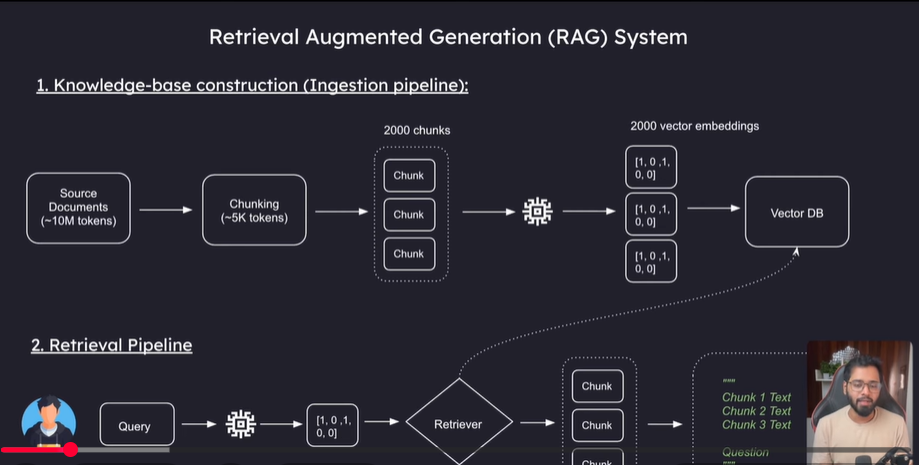

1. Vector DB(Mivius, Chroma DB)
2. Indexing(Chunk1, Chunk2)

Rag Categories
1. Vector Rag 
	1. Naive Rag
	2. Hybride Rag(Elastic Search, vector db)
2. Vector less Rag
	1. Keyword RAG
	2. Graph RAG
	3. SQL RAG
	4. Reasoning based RAG

Source: https://www.youtube.com/watch?v=63B-3rqRFbQ&list=PLNIQLFWpQMRUMjxfe8o6g3uzJ6LH_VotY
Fundamentals:

Real World example:
100 of documents

AI Context window
GPT-4.1/Gemini 2.5 pro -> 1M tokens

Tokens: 
Hello -> 1 token
I'm -> 2 tokens

PDF 10 M tokens cannot feed LLM

1. Knoledge-base contruction(Ingestion pipeline)

Source Documents(10 M Tokens)
Chunking(1K tokens)
10,000 chunks. Chunks pass to the embedding model
Embedding Model
2000 Vector embeddings
store it into the Vector DB

2. Retrival Pipeline
user -> Query -> Embedding model -> vector representation -> Retriever(go to vector DB and search) ->  Chunks -> Output as text

What is Embeddings
Mathematical representation of words
example: 
cat - [34, 8, 75]
      [Size, Domestic, ]
Kitten - [33, 8,2]

Popular Embedding models: 
Open ai embedding models
1. Text-embedding-3-small: 1536 dimenstions
2. text-embedding-3-large: 3072 dimenstions
Voyage embedding models
1. go to website and see

Vector DBS:
1. Pinecone, Weaviate, ChormaDB, FAISS
2. SQL

(Project)
Build Data Ingestion Pipeline With Python
create file
ingestion_pipeline.py
python3 -m venv venu
source venv/bin/activate -> this is for mac
pip install langchain langchain-community langchanin_text_splitters langchain_openai langchain_chroma python_dotenv
.env -> create this file

main function
print("Main function")
	1. Load all the files from docs dir
	2. Chunking the files
	3. Embedding(used Open AI key or free-> Ollama mode opensource model) the storing in vector DB

always use the cosine similarity(algorithem)
Cosine similarity:
measure the value b/w cat and dog
cosine_similarity = (A-B)/(||A|| * ||B||)
|| -> magnitude

Query
it will provide the 5 relevent chunks(5 -> configurable)

